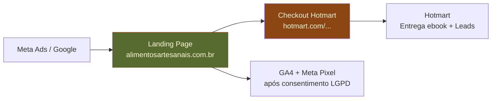
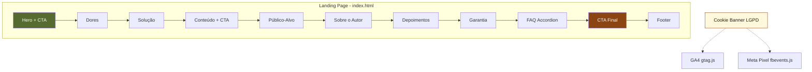
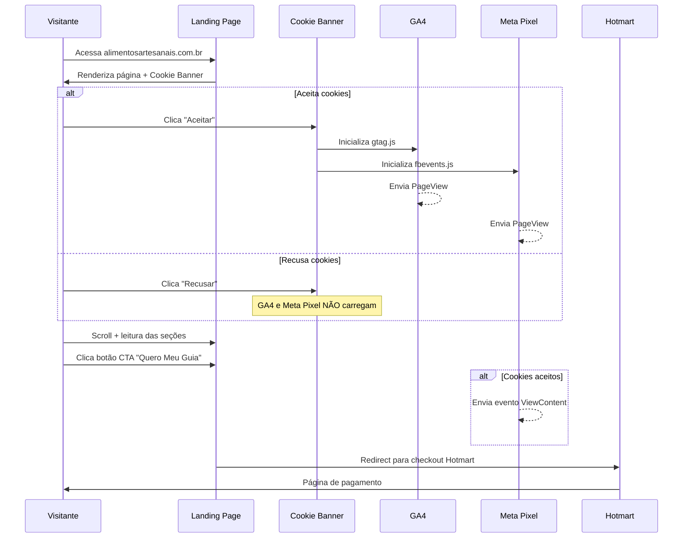

# Guia Estratégico para Produtores Artesanais — Architecture Document

## 1. Introduction

### Technical Summary

Arquitetura de página estática única (single-page) construída com HTML5 semântico, CSS3 com custom properties e JavaScript vanilla mínimo. Zero dependências de build, zero backend, zero banco de dados. O checkout é delegado 100% à Hotmart via link externo. A estratégia prioriza performance (Lighthouse >= 90), responsividade mobile-first e conformidade LGPD para tracking (GA4 + Meta Pixel).

### Starter Template

N/A — projeto from scratch. Para uma landing page estática de 1 arquivo HTML, qualquer starter template adicionaria complexidade desnecessária.

### Change Log

| Date | Version | Description | Author |
|------|---------|-------------|--------|
| 2026-02-22 | 0.1 | Initial architecture | Aria (Architect) |

---

## 2. High Level Architecture

### High Level Overview

- **Estilo arquitetural:** Página estática (Static Site) — o modelo mais simples possível
- **Repositório:** Monorepo flat — um repositório, um projeto
- **Service architecture:** Sem serviços — arquivo HTML servido diretamente por CDN/hosting
- **Fluxo do usuário:** Anúncio/Google → Landing Page (scroll) → CTA → Checkout Hotmart (externo)
- **Decisão chave:** Zero build step — sem webpack, sem npm, sem bundler. Arquivos servidos como estão

### High Level Project Diagram



### Architectural and Design Patterns

- **Static Site Pattern:** Arquivo HTML único servido por CDN — sem server-side rendering, sem hydration, sem SPA routing. _Rationale:_ Máxima performance, zero custo de servidor, zero complexidade de deploy
- **CSS Custom Properties (Design Tokens):** Paleta de cores, tipografia e espaçamentos definidos como variáveis CSS no `:root`. _Rationale:_ Permite tematização consistente sem pré-processador, mantém zero build step
- **Progressive Enhancement:** HTML semântico funcional sem JS → CSS para visual → JS para interatividade (accordion, scroll animations). _Rationale:_ Página funciona mesmo com JS desabilitado, melhor acessibilidade e SEO
- **Consent-First Tracking:** Scripts de analytics bloqueados por padrão, ativados somente após consentimento LGPD. _Rationale:_ Conformidade legal obrigatória no Brasil

---

## 3. Tech Stack

### Cloud Infrastructure

- **Hosting:** Vercel (recomendado) ou Netlify — CDN global, HTTPS automático, deploy via git push
- **DNS:** Apontar alimentosartesanais.com.br para o hosting escolhido
- **CDN:** Incluído no Vercel/Netlify — cache automático de assets estáticos

### Technology Stack Table

| Category | Technology | Version | Purpose | Rationale |
|----------|-----------|---------|---------|-----------|
| **Markup** | HTML5 | Living Standard | Estrutura semântica da página | Padrão web, SEO nativo, acessibilidade |
| **Styling** | CSS3 | Living Standard | Design visual e responsividade | Custom properties para tokens, zero build |
| **Scripting** | JavaScript | ES2020+ | FAQ accordion, scroll animations, cookie banner | Vanilla — zero dependências, <2KB total |
| **Fonts** | Google Fonts | CDN | Montserrat (headlines) + Lora (corpo) | Gratuito, CDN otimizado, font-display: swap |
| **Images** | WebP + JPG fallback | — | Fotos e mockups | WebP ~30% menor que JPG, fallback para Safari antigo |
| **Analytics** | Google Analytics 4 | gtag.js | Tracking de pageview e eventos | Padrão de mercado, gratuito |
| **Ads Tracking** | Meta Pixel | fbevents.js | Tracking de conversão para Meta Ads | Obrigatório para otimização de campanhas |
| **Hosting** | Vercel | Free tier | Hospedagem e CDN | HTTPS grátis, deploy via git, CDN global |
| **Version Control** | Git | 2.x | Controle de versão | Padrão de mercado |

---

## 4. Components

Para uma landing page estática, os "componentes" são seções HTML com seus respectivos estilos.

### Page Sections Map

| Componente | Responsabilidade | FRs Relacionados |
|------------|-----------------|------------------|
| **Hero** | Primeira impressão, headline, CTA primário | FR1, FR11 |
| **Dores** | Identificação com problemas do público | FR2 |
| **Solução** | Posicionamento do ebook como resposta | FR3 |
| **Conteúdo** | Lista do que o leitor vai aprender + CTA | FR4, FR11 |
| **Público** | Segmentação de quem é o guia | FR5 |
| **Autor** | Credenciais e confiança | FR6 |
| **Depoimentos** | Prova social (placeholders) | FR7 |
| **Garantia** | Redução de risco (7 dias Hotmart) | FR8 |
| **FAQ** | Objeções finais (accordion JS) | FR9 |
| **CTA Final** | Último ponto de conversão | FR10, FR11 |
| **Footer** | Copyright, legal, privacidade | — |
| **Cookie Banner** | Consentimento LGPD | FR14, NFR7 |

### Component Diagram



---

## 5. External APIs

| Serviço | Tipo | Integração | Notas |
|---------|------|-----------|-------|
| **Hotmart Checkout** | Link externo | `<a href="https://pay.hotmart.com/SEU_ID">` | Sem API — apenas redirect para URL de checkout |
| **Google Analytics 4** | Script tag | `gtag.js` via CDN Google | Carregado condicionalmente após consentimento LGPD |
| **Meta Pixel** | Script tag | `fbevents.js` via CDN Meta | Carregado condicionalmente após consentimento LGPD |
| **Google Fonts** | CSS link | `<link>` no `<head>` | Montserrat + Lora, preconnect para performance |

Nenhuma integração requer API key no código-fonte. GA4 e Meta Pixel usam IDs públicos (measurement ID e pixel ID).

---

## 6. Core Workflow

### User Journey Flow



---

## 7. Source Tree

```
guia-produtores-artesanais/
├── index.html              # Página única (todas as seções)
├── css/
│   └── styles.css          # Estilos completos (reset + tokens + seções)
├── js/
│   ├── main.js             # FAQ accordion + scroll animations
│   └── cookie-consent.js   # Banner LGPD + carregamento condicional de analytics
├── assets/
│   ├── images/
│   │   ├── hero-ebook-mockup.webp
│   │   ├── hero-ebook-mockup.jpg    # fallback
│   │   ├── author-photo.webp
│   │   ├── author-photo.jpg         # fallback
│   │   ├── og-image.jpg             # 1200x630 para Open Graph
│   │   └── favicon.ico
│   └── icons/
│       └── (SVG inline no HTML — sem arquivos separados)
├── vercel.json             # Security headers + redirects
├── robots.txt
├── sitemap.xml
└── README.md               # Instruções de setup e deploy
```

**Decisões de estrutura:**
- **CSS em 1 arquivo** — para uma landing page, split em múltiplos arquivos adiciona HTTP requests sem benefício (CSS total estimado ~8KB gzipped)
- **JS em 2 arquivos** — separação lógica entre interatividade da página e lógica de consentimento LGPD
- **SVG inline** — ícones embutidos no HTML para zero requests adicionais
- **Sem pasta /fonts** — fontes servidas via Google Fonts CDN
- **Sem pasta /vendor** — zero dependências de terceiros

---

## 8. Infrastructure and Deployment

### Deployment Strategy

- **Plataforma:** Vercel (Free tier)
- **Método:** Git push → deploy automático
- **CDN:** Vercel Edge Network (global, automático)
- **HTTPS:** Automático via Let's Encrypt
- **Domínio custom:** alimentosartesanais.com.br configurado via DNS

### Environments

| Ambiente | URL | Propósito |
|----------|-----|-----------|
| **Production** | alimentosartesanais.com.br | Página pública final |
| **Preview** | *.vercel.app (auto-gerado) | Preview de cada push/PR |

### Promotion Flow

```
Local dev → git push → Vercel Preview → Verificação visual → Merge to main → Production
```

### Rollback Strategy

- **Método:** Vercel mantém histórico de deploys — rollback via dashboard em 1 clique
- **Trigger:** Página quebrada ou erro visual detectado
- **RTO:** < 1 minuto (redeploy de versão anterior)

---

## 9. CSS Architecture

### Design Tokens (Custom Properties)

```css
:root {
  /* Colors */
  --color-olive: #556B2F;
  --color-olive-light: #6B8E3A;
  --color-brown: #8B4513;
  --color-brown-light: #A0522D;
  --color-cream: #FFF8DC;
  --color-white: #FFFFFF;
  --color-text: #2C1810;
  --color-text-light: #5C4A3A;

  /* Typography */
  --font-heading: 'Montserrat', sans-serif;
  --font-body: 'Lora', serif;
  --font-size-base: 16px;
  --font-size-sm: 0.875rem;
  --font-size-lg: 1.125rem;
  --font-size-xl: 1.5rem;
  --font-size-2xl: 2rem;
  --font-size-3xl: 2.5rem;
  --font-size-hero: 3rem;

  /* Spacing */
  --space-xs: 0.5rem;
  --space-sm: 1rem;
  --space-md: 1.5rem;
  --space-lg: 2rem;
  --space-xl: 3rem;
  --space-2xl: 4rem;
  --space-section: 5rem;

  /* Layout */
  --max-width: 1200px;
  --content-width: 800px;

  /* Borders */
  --radius-sm: 4px;
  --radius-md: 8px;
  --radius-lg: 16px;
  --radius-full: 9999px;

  /* Shadows */
  --shadow-sm: 0 1px 3px rgba(44, 24, 16, 0.1);
  --shadow-md: 0 4px 12px rgba(44, 24, 16, 0.15);
  --shadow-lg: 0 8px 24px rgba(44, 24, 16, 0.2);

  /* Transitions */
  --transition-fast: 150ms ease;
  --transition-base: 300ms ease;
}
```

### CSS File Organization (within styles.css)

```
1. Reset/Normalize (minimal)
2. Custom Properties (:root)
3. Base styles (body, typography, links)
4. Utility classes (.container, .sr-only, .text-center)
5. Components (buttons, cards, badges)
6. Sections (hero, pain-points, solution, content, audience, author, testimonials, guarantee, faq, final-cta, footer)
7. Cookie banner
8. Media queries (tablet 768px, desktop 1024px)
```

### Responsive Strategy

```css
/* Mobile-first: base styles are mobile */
.hero__title { font-size: var(--font-size-2xl); }

/* Tablet */
@media (min-width: 768px) {
  .hero__title { font-size: var(--font-size-3xl); }
}

/* Desktop */
@media (min-width: 1024px) {
  .hero__title { font-size: var(--font-size-hero); }
}
```

---

## 10. Coding Standards

### Core Standards

- **Linguagens:** HTML5, CSS3, JavaScript ES2020+
- **Indentação:** 2 espaços
- **Charset:** UTF-8 em todos os arquivos
- **Line endings:** LF (Unix)

### Naming Conventions

| Element | Convention | Example |
|---------|-----------|---------|
| Arquivos | kebab-case | `cookie-consent.js` |
| CSS classes | BEM (Block__Element--Modifier) | `hero__cta--primary` |
| CSS custom properties | kebab-case com prefixo | `--color-olive`, `--font-heading` |
| JS functions | camelCase | `toggleAccordion()` |
| JS constants | UPPER_SNAKE_CASE | `HOTMART_CHECKOUT_URL` |
| HTML ids | kebab-case | `faq-section` |

### Critical Rules

- **Zero dependências externas:** Nenhum `npm install`, nenhum CDN de JS libraries (exceto Google Fonts, GA4, Meta Pixel)
- **CSS sem !important:** Usar especificidade adequada. `!important` indica problema de arquitetura CSS
- **Imagens com dimensões explícitas:** Todo `` deve ter `width` e `height` para evitar CLS (Cumulative Layout Shift)
- **Links externos com atributos:** Todo link para fora do domínio deve ter `target="_blank" rel="noopener noreferrer"`
- **HOTMART_CHECKOUT_URL centralizado:** URL de checkout definido como constante JS no topo do `main.js`, nunca hardcoded em múltiplos lugares no HTML
- **Consentimento antes de tracking:** GA4 e Meta Pixel NUNCA devem carregar antes do aceite do cookie banner

---

## 11. Security

### Security Overview

| Área | Implementação | Notas |
|------|--------------|-------|
| **HTTPS** | Automático via Vercel/Netlify | Obrigatório para Meta Ads |
| **CSP Headers** | Configurar via `vercel.json` | Restringir scripts a Google, Meta, Google Fonts |
| **LGPD** | Cookie banner com opt-in | GA4/Pixel só carregam após consentimento |
| **Links externos** | `rel="noopener noreferrer"` | Previne tabnabbing |
| **Inputs** | Nenhum input na página | Sem formulário = sem XSS/injection |
| **Secrets** | Nenhum secret no código | GA4 ID e Pixel ID são públicos por design |

### Security Headers (vercel.json)

```json
{
  "headers": [
    {
      "source": "/(.*)",
      "headers": [
        { "key": "X-Content-Type-Options", "value": "nosniff" },
        { "key": "X-Frame-Options", "value": "DENY" },
        { "key": "Referrer-Policy", "value": "strict-origin-when-cross-origin" }
      ]
    }
  ]
}
```

---

## 12. Test Strategy

| Tipo | Método | Critério |
|------|--------|----------|
| **Performance** | Lighthouse CLI ou PageSpeed Insights | Score >= 90 em mobile |
| **Responsividade** | DevTools + resize manual | Sem quebra em 320px-1920px |
| **Cross-browser** | Teste manual em Chrome, Safari, Firefox, Edge | Funcional e visual ok |
| **Links** | Verificação manual de todos CTAs | Redirect correto para Hotmart |
| **Acessibilidade** | Lighthouse Accessibility + teste de teclado | Score >= 90, tab navigation funcional |
| **LGPD** | Teste manual do cookie banner | GA4/Pixel bloqueados até aceite |
| **SEO** | Lighthouse SEO + verificação de meta tags | Score >= 90, OG tags válidas |

Sem testes unitários — não há lógica de negócio para testar automaticamente.

---

## 13. Next Steps

### Dev Agent Prompt

> @dev Implementar a landing page do ebook "Guia Estratégico para Produtores Artesanais" seguindo o PRD em `docs/prd.md` e a arquitetura em `docs/architecture/architecture.md`. Iniciar pela Story 1.1 (Project Foundation & Hero Section). Tech stack: HTML5/CSS3/JS vanilla, zero dependências, mobile-first. Seguir design tokens da Seção 9 (CSS Architecture) e naming conventions BEM.

### DevOps Agent Prompt

> @devops Configurar repositório Git, conectar ao Vercel, configurar domínio alimentosartesanais.com.br e security headers conforme `docs/architecture/architecture.md` Seção 11.
